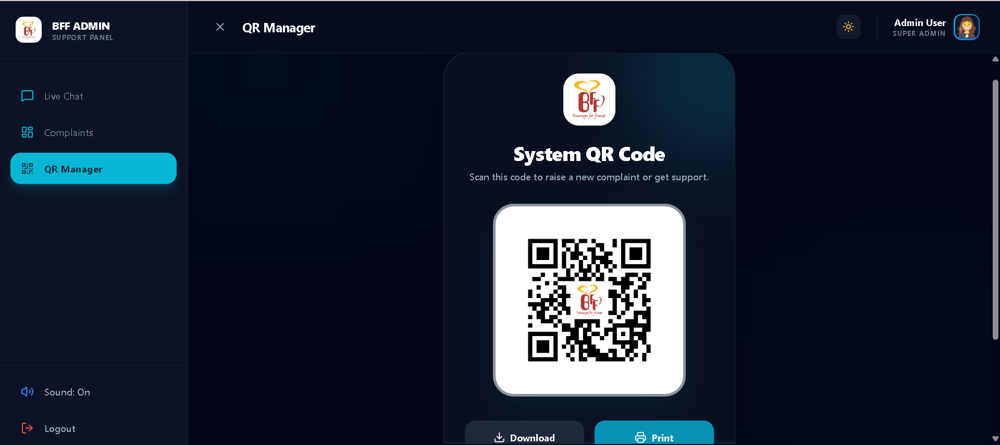
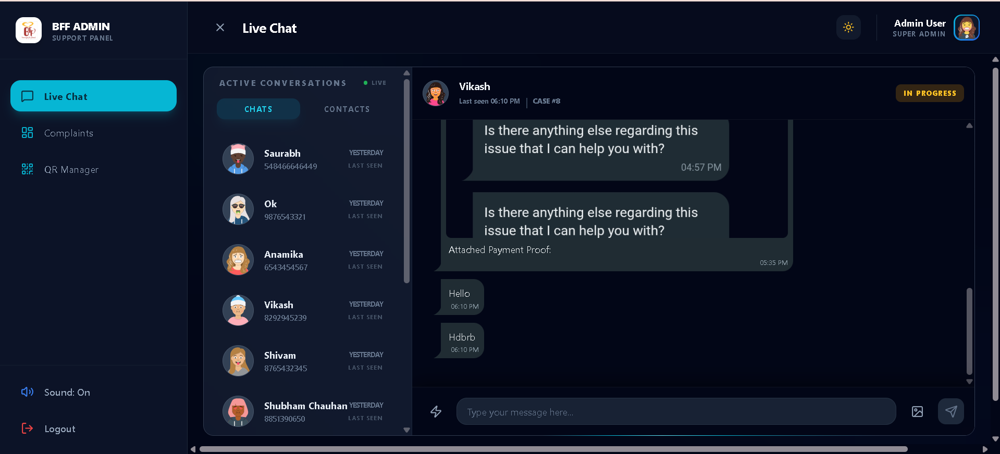
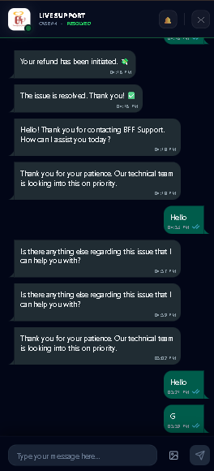
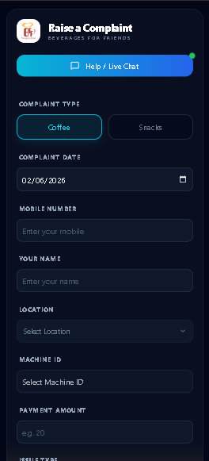

# 🚀 BFF Smart Vending Complaint Dashboard

A robust, real-time Complaint Management System designed for Smart Vending Machines. This application bridges the gap between customers and support teams with instant chat, live status updates, and a powerful admin dashboard.

## ✨ Key Features

- **Real-time Support Chat**: Seamless communication powered by **Socket.io**.
- **Live Status Tracking**: Customers can track their complaint status (Pending → In Progress → Resolved) in real-time.
- **Admin Dashboard**:
    - Comprehensive analytics & charts.
    - Export reports to **Excel** & **PDF**.
    - Manage complaints efficiently with filtering and search.
- **Push Notifications**: Instant alerts for new messages and status updates.
- **Responsive Design**: Optimized for both Desktop (Admin) and Mobile (User) experiences using **TailwindCSS**.

## 🛠️ Tech Stack

### Frontend
- **Framework**: React.js (Vite)
- **Styling**: TailwindCSS, DaisyUI
- **State Management**: Zustand
- **Real-time**: Socket.io Client
- **Charts**: Recharts

### Backend
- **Runtime**: Node.js
- **Framework**: Express.js
- **Database**: MySQL
- **Real-time**: Socket.io
- **Notifications**: Web-Push, Telegram Bot Integration

## 🚀 Getting Started

### Prerequisites
- Node.js (v18+)
- MySQL Server

### 1. Clone the Repository
```bash
git clone https://github.com/your-username/bff-complaint-dashboard.git
cd bff-complaint-dashboard
```

### 2. Backward Setup
```bash
cd Complain-Dashboard
npm install
```
- Copy `.env.example` to `.env` and configure your Database & Keys.
```bash
cp .env.example .env
```
- Run the server:
```bash
npm start
# or for development
npm run dev
```

### 3. Frontend Setup
```bash
cd ../Frontend/frontend
npm install
```
- Copy `.env.example` to `.env`.
```bash
cp .env.example .env
```
- Start the development server:
```bash
npm run dev
```

## 📅 Development Timeline (Aggressive Sprint)

This project was architected and built in a highly focused **7-Day Sprint**, demonstrating rapid prototyping and scalable engineering.

| Phase | Duration | Key Milestones |
| :--- | :--- | :--- |
| **Phase 1: Architecture** | Day 1-2 | • Designed MySQL Schema relations.<br>• Set up Node.js/Express Server structure.<br>• Initialized React + Vite frontend with TailwindCSS. |
| **Phase 2: Core Logic** | Day 3-4 | • Built RESTful APIs for Complaints & Users.<br>• Implemented JWT Auth & Secure middleware.<br>• Integrated **Socket.io** for bi-directional communication. |
| **Phase 3: Real-time Features** | Day 5 | • Developed the Live Chat interface.<br>• Added Typing Indicators & "Read/Delivered" receipts.<br>• Synced data across Admin & User portals instantly. |
| **Phase 4: Polish & UI** | Day 6 | • Designed the "Glassmorphism" UI for Admin Dashboard.<br>• Created the sleek Mobile-First User Chat view.<br>• Added micro-animations using Framer Motion/CSS. |
| **Phase 5: Deploy & Testing** | Day 7 | • Stress tested Socket connections.<br>• Integrated Push Notifications (VAPID).<br>• Final deployment & documentation. |

---

## 📸 Project Gallery

A glimpse into the **BFF Support Dashboard** interface.

### 🖥️ Admin Dashboard & Analytics
> *Comprehensive view for support agents to manage tickets and view live stats.*

<p align="center">
  
  
</p>

### 📱 Mobile User Chat Experience
> *Seamless, native-app like experience for customers to chat with support.*

<p align="center">
  
  
  
</p>

---

## 📄 License

This project is licensed under the MIT License.
